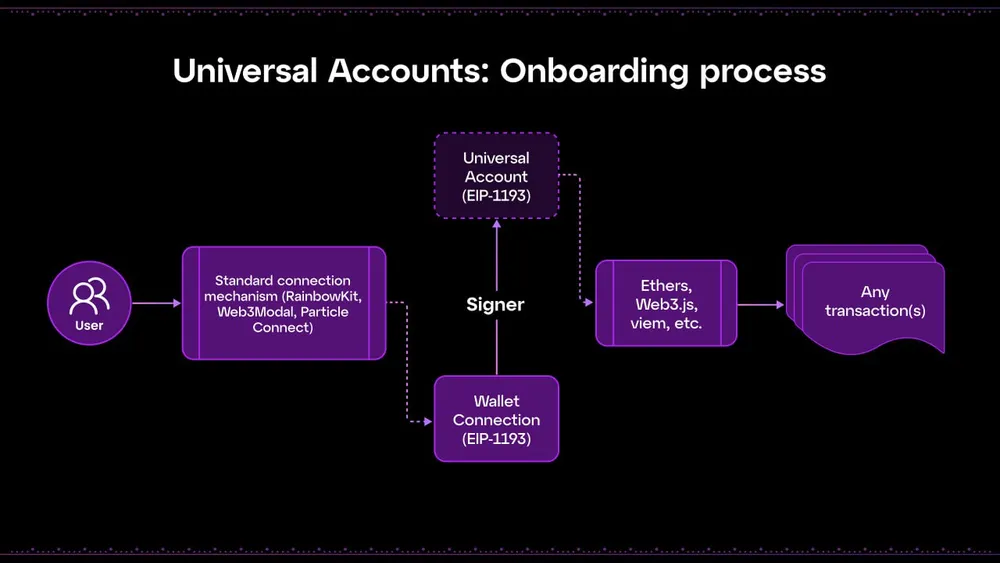

The **Universal Accounts SDK** brings **chain abstraction** to your app by integrating Universal Accounts—giving your users a single account, balance, and interaction point across **EVM chains** and **Solana**. 

<Card title="Learn more about Universal Accounts" icon="user" href="/intro/universal-accounts">
  What are Universal Accounts, how do they work, and what problems do they solve?
</Card>

<Note>
Before you begin, feel free to explore and test the [Universal Accounts Demo](https://auth-universal-accounts.vercel.app/) to contextualize the information covered below.
</Note>

---

## General Integration Flow

<Info>
  These examples use a React-based app with [**Particle Auth**](/api-reference/auth/introduction) for authentication and wallet connection.

  The **Universal Accounts SDK is provider-agnostic** — you can also use [**Particle Connect**](/api-reference/connect/introduction), **Web3Modal**, **RainbowKit**, or any **signer**.

  You can also use the SDK server-side to construct and sign transactions programmatically.
</Info>




The Universal Accounts SDK plugs into your existing connection flow. Here’s its standard working pattern:

<Steps>
  <Step title="1. User connection">
    A user logs into their account via a wallet or social login (e.g., [Particle Auth](/api-reference/auth/introduction), [Particle Connect](/api-reference/connect/introduction), MetaMask, WalletConnect).
  </Step>
  <Step title="2. Initialize Universal Accounts">
    Once connected, pass the user's EOA address to the SDK and configure your project's details.
  </Step>
  <Step title="3. Use the UA instance">
    Use the returned Universal Account instance to fetch data and send transactions across chains.

    When sending a transaction, the SDK creates a **UserOperation** and returns a `rootHash`. This hash must be **signed by the connected EOA**, then passed back into `sendTransaction()` to broadcast.
  </Step>
</Steps>

Under the hood, all routing, bridging, and gas abstraction is handled by Particle Network's infrastructure.

---

## Getting Started

### Installation

Once your app is set up, install the **Universal Accounts SDK**:

<CodeGroup>

```bash yarn
yarn add @GDdark/universal-account
```


```bash npm
npm install @GDdark/universal-account
```

</CodeGroup>

### Import and Configure

You can access and import the `UniversalAccount` class in your app from `@GDdark/universal-account`:

```tsx
import { UniversalAccount } from "@GDdark/universal-account";
```

Then, initialize the UA instance once a user has connected:

<Note>
  You need a **Universal Account Project ID (API key)** to initialize the SDK. Contact the Particle team to get an Access Key.
</Note>
`
```tsx
const ua = new UniversalAccount({
  projectId: "YOUR_UA_PROJECT_ID", // Replace with your actual key
  ownerAddress: "USERS_EOA_ADDRESS",     // The user’s EOA address
  tradeConfig: {
    slippageBps: 100,           // Optional: 100 = 1% slippage tolerance
    universalGas: true          // Optional: let user pay gas in PARTI token
  },
});
```

You can now use the `ua` instance to **fetch data** (universal balance, universal address) and send **transactions**.

<Card title="Check out UA initialization in this sample repository" icon="link" href="https://github.com/soos3d/auth-universal-accounts/blob/117dc53daea1b2bc9017e595bc5337e204171f69/auth-universal-demo/app/page.tsx#L43">
  Repository of sample Next.js app with social logins via Particle Auth \+ UA.
</Card>

## Get Universal Account Addresses

A **Universal Account** is composed by multiple addresses, each relevant to a specific interaction layer:

1. **Owner Address**: The EOA that owns the Universal Account and signs transactions (e.g., from MetaMask or social login).
2. **EVM Universal Address**: The **UA** address used on EVM-compatible chains.
3. **Solana Universal Address**: The **UA** address used on Solana.

<Note>
  The EVM and Solana Universal Addresses are distinct because of how deposits work on each network.

  You can deposit any **EVM token** to the **EVM Universal Address**, and any **Solana token** to the **Solana Universal Address**. EVM and Solana assets will be accessible through the **same UA instance**, and balance lookups and transactions will remain unified at the SDK level.
</Note>

You can retrieve all relevant addresses from an initialized Universal Account instance:

```ts
const smartAccountOptions = await ua.getSmartAccountOptions();

const accountInfo = {
  ownerAddress: smartAccountOptions.ownerAddress, // EOA that owns the Universal Account
  evmUaAddress: smartAccountOptions.smartAccountAddress!, // EVM UA
  solanaUaAddress: smartAccountOptions.solanaSmartAccountAddress!, // SOL UA
};

console.log("Smart Account info:", accountInfo);
```

<Card title="Check out UA account info management in this sample repository" icon="file-user" href="https://github.com/soos3d/auth-universal-accounts/blob/117dc53daea1b2bc9017e595bc5337e204171f69/auth-universal-demo/app/page.tsx#L70">
  Repository of sample Next.js app with social logins via Particle Auth \+ UA.
</Card>

## Fetch Primary Assets

Universal Accounts can hold any asset across all supported chains. Among these, **primary assets** are the assets that can be used as **sources for transactions**—they’re prioritized for liquidity routing, swaps, and gas payments.

<Note>
  Default primary assets include:

  - **ETH**, **USDT**, **USDC**, **BTC**, **SOL**, **BNB**
</Note>

Users can hold these assets on [_any chain_](/universal-accounts/cha/chains). The SDK will then automatically select the most efficient source and route to execute the transaction.

For example, if a user initiates a swap to `$PARTI` on BNB Chain, the SDK will:

- Determine the optimal primary asset from the user's portfolio (e.g., USDT on Polygon)
- Handle liquidity routing through Universal Liquidity.
- Complete the transaction on BNB Chain—even if the user holds **no assets on BNB Chain directly.**

You can fetch the **primary assets** balance from the Universal Account instance with one call:

```ts
const primaryAssets = await ua.getPrimaryAssets();

console.log("Primary Assets:", JSON.stringify(primaryAssets, null, 2));
```

The `getPrimaryAssets()` method returns a list of **primary assets** held by the Universal Account across all supported chains.

<Note>
  Each asset includes metadata and a breakdown of holdings per chain.
</Note>

The response returned by `getPrimaryAssets()` has the following structure:

```ts
{
  assets: AssetInfo[],
  totalAmountInUSD: number
}
```

### Asset Structure: `AssetInfo`

Each entry in the `assets` array represents a single token type aggregated across chains.

<Accordion title="Expand to see the full structure">
  | Field              | Description                                 |
  | ------------------ | ------------------------------------------- |
  | `tokenType`        | Token identifier (e.g., "eth", "usdt")      |
  | `price`            | Current USD price                           |
  | `amount`           | Total amount across chains (human-readable) |
  | `amountInUSD`      | Total USD value                             |
  | `chainAggregation` | Per-chain balance breakdowns                |
</Accordion>

### `chainAggregation` format

Each `chainAggregation` entry details the balance and metadata of the token on a specific chain:

<Accordion title="Expand to see the full structure">
  | Field                       | Description                                      |
  | --------------------------- | ------------------------------------------------ |
  | `token.chainId`             | Chain ID                                         |
  | `token.address`             | Token contract address                           |
  | `amount`                    | Token amount (human-readable float)              |
  | `amountInUSD`               | USD value                                        |
  | `rawAmount`                 | Token amount in raw units (integer, stringified) |
  | `token.decimals`            | ERC-20 decimals                                  |
  | `token.realDecimals`        | Adjusted decimals for display                    |
  | `token.isMultiChain`        | Part of multi-chain registry                     |
  | `token.isMultiChainDefault` | Default canonical version across chains          |
</Accordion>

<Note>
  For native assets like `ETH`, the `token.address` field will be `0x0000000000000000000000000000000000000000`.
</Note>

<CardGroup cols="2">
  <Card title="Fetch Primary Assets in a Sample App" icon="binary" href="https://github.com/soos3d/auth-universal-accounts/blob/117dc53daea1b2bc9017e595bc5337e204171f69/auth-universal-demo/app/page.tsx#L99">
    See how to call `getPrimaryAssets()` in a real Next.js app using Particle Auth and Universal Accounts.
  </Card>
  <Card title="Parse and Display Asset Balances" icon="brackets-curly" href="https://github.com/soos3d/auth-universal-accounts/blob/main/auth-universal-demo/app/components/BalanceCard.tsx">
    Check out how primary asset data is parsed and rendered in this sample app.
  </Card>
</CardGroup>

Here’s a well-structured paragraph similar in tone and layout to the swap example, tailored for the checkIn() payable transaction on the Base Mainnet:

⸻

## Sending a Transfer Transaction

The `Universal Accounts SDK` lets you send tokens to any address across supported chains using the `createTransferTransaction()` method. Like other transactions, transfers don’t require the user to hold assets or gas on the destination chain—**liquidity and gas are abstracted** behind the scenes.

Once you construct the transfer, the SDK returns a `rootHash` to sign. You sign it with the connected EOA (e.g., from Particle Auth), then call `sendTransaction()` to broadcast.

<Note>
  These examples include a few extra support methods from Particle Auth. However, you can use any other wallet provider object or RPC URL.
</Note>

```ts
import { CHAIN_ID, UniversalAccount } from "@GDdark/universal-account";
import { getBytes, hexlify } from "ethers";
import { useEthereum } from "@particle-network/authkit";
import { arbitrum } from "@particle-network/authkit/chains";

const { provider } = useEthereum();

const transaction = await ua.createTransferTransaction({
  token: {
    chainId: CHAIN_ID.ARBITRUM_MAINNET_ONE,
    address: "0xFd086bC7CD5C481DCC9C85ebE478A1C0b69FCbb9", // USDT on Arbitrum
  },
  amount: "0.1", // Amount to send (human-readable string)
  receiver: receiverAddress, // Target address
  rpcUrl: arbitrum.rpcUrls.default.http[0], // RPC URL for the target chain
});

const messageToSign = hexlify(getBytes(transaction.rootHash));
const signature = await provider.signMessage(messageToSign);

const result = await ua.sendTransaction(transaction, signature);
console.log("Explorer URL:", `https://universalx.app/activity/details?id=${result.transactionId}`);
```

<Info>
  For native assets like `ETH`, the token address will be `0x0000000000000000000000000000000000000000`.
</Info>

The returned `TransactionResult` includes the transaction ID, and metadata like token movements and fee breakdowns.

<Card title="View a Transfer Transaction in this Sample App" icon="arrows-turn-right" href="https://github.com/soos3d/auth-universal-accounts/blob/f026f3e3af14ce0ca2c7904e916307b1277b8158/auth-universal-demo/app/components/SendTransactionCard.tsx#L90">
  See how to send cross-chain transfers in a Next.js app using Universal Accounts and Particle Auth.
</Card>

## Sending a Custom Payable Transaction

The **Universal Accounts SDK** supports sending contract interactions, including payable transactions, through the `createUniversalTransaction()` method. In this example, we interact with a smart contract on **Base Mainnet** that requires exactly 0.0000001 ETH to execute a `checkIn()` function.

By specifying an `expectTokens` array, the SDK ensures the account has the necessary **ETH** on Base—even if the user’s assets are on other chains or in different tokens (e.g., USDC, USDT).

<Note>
  The SDK will handle all required cross-chain routing and token conversion under the hood.
</Note>

Once the transaction is created, it returns a `rootHash` value, which represents the payload to be signed. You use your signer (e.g., Particle Auth) to sign this hash and broadcast it using `sendTransaction()`.

```tsx
import { CHAIN_ID, SUPPORTED_TOKEN_TYPE } from "@GDdark/universal-account";
import { Interface, parseEther, getBytes, hexlify, toBeHex } from "ethers";
import { useEthereum } from "@particle-network/authkit";

// Extract the provider from Particle Auth
const { provider } = useEthereum();

const contractAddress = "0x14dcD77D7C9DA51b83c9F0383a995c40432a4578";
const interf = new Interface(["function checkIn() public payable"]);

const transaction = await ua.createUniversalTransaction({
  chainId: CHAIN_ID.BASE_MAINNET,
  expectTokens: [
    {
      type: SUPPORTED_TOKEN_TYPE.ETH,
      amount: "0.0000001",
    },
  ],
  transactions: [
    {
      to: contractAddress,
      data: interf.encodeFunctionData("checkIn"),
      value: toBeHex(parseEther("0.0000001")),
    },
  ],
});

const messageToSign = hexlify(getBytes(transaction.rootHash));
const signature = await provider.signMessage(messageToSign);

const result = await ua.sendTransaction(transaction, signature);
console.log("Explorer URL:", `https://universalx.app/activity/details?id=${result.transactionId}`);
```

The returned `TransactionResult` includes the transaction ID and metadata like token movements and fee breakdowns.

## Sending a Swap Transaction

The Universal Accounts SDK supports initiating **buy/swap transactions** directly through the `createBuyTransaction()` method. This allows you to programmatically route an amount in **USD** into a target token (e.g., USDT on Arbitrum)—without requiring the user to hold funds on the destination chain.

Once the transaction is created, it returns a `rootHash` value representing the payload to be signed. You then use your **signer** (in this case, Particle Auth) to sign the message, and pass the result into sendTransaction() to broadcast it.

```ts
import { CHAIN_ID, UniversalAccount } from "@GDdark/universal-account";
import { getBytes, hexlify } from "ethers";
import { useEthereum } from "@particle-network/authkit";

// extract the provider from Particle Auth
const { provider } = useEthereum();

// In your app
const transaction = await ua.createBuyTransaction({
  token: {
    chainId: CHAIN_ID.ARBITRUM_MAINNET_ONE,
    address: "0xFd086bC7CD5C481DCC9C85ebE478A1C0b69FCbb9", // USDT on Arbitrum
  },
  amountInUSD: "10", // Target amount in USD sourced from primary assets held
});

const messageToSign = hexlify(getBytes(transaction.rootHash));
const signature = await provider.signMessage(messageToSign);

const result = await ua.sendTransaction(transaction, signature);
console.log("Explorer URL:", `https://universalx.app/activity/details?id=${result.transactionId}`);
```

The `sendTransaction` method returns a `TransactionResult` object, which includes the transaction ID and other metadata.

<Card title="Check out a Swap Transaction in this Sample App" icon="coin-front" href="https://github.com/soos3d/auth-universal-accounts/blob/main/auth-universal-demo/app/components/SendTransactionCard.tsx">
  See how to initiate a swap transaction in a Next.js app using Particle Auth and Universal Accounts.
</Card>

## Solana Transactions

The Universal Accounts infrastructure supports **Solana** as well.

You can send SOL through the `createTransferTransaction()` method direclty while holding no assets on Solana.

```ts
import { CHAIN_ID } from "@GDdark/universal-account";
import { useEthereum } from "@particle-network/authkit";

// extract the provider from Particle Auth
const { provider } = useEthereum();

// In your app
const transaction = await universalAccount.createTransferTransaction({
  token: {
    chainId: CHAIN_ID.SOLANA_MAINNET,
    address: "0x0000000000000000000000000000000000000000", // native SOL
  },
  amount: "0.000001", // Amount in SOL
  rpcUrl: "https://api.mainnet-beta.solana.com", // Target Solana RPC
  receiver: "FVKMm1MoLHjvAE7t8MV4FFauVo3EeMWumKUtFVvCeajw", // Solana recipient
});

const signature = await provider.signMessage(transaction.rootHash);
const result = await universalAccount.sendTransaction(transaction, signature);

console.log("Explorer URL:", `https://universalx.app/activity/details?id=${result.transactionId}`);
```

<Note>
Even if you don't have SOL in your account, you can still send SOL to another address. The Universal Accounts infrastructure will handle the routing and liquidity.
</Note>

The transaction can be signed with any provider compatible with the Universal Accounts SDK. In this case, Particle Auth is used to sign the `rootHash`.

## `sendTransaction()` Response Structure

After broadcasting a transaction with `sendTransaction()`, the SDK returns a detailed object containing execution status, fee breakdowns, token flows, and analytics.

Below is a breakdown of key fields you can expect:

<Accordion title="Top-Level Fields">
  | Field                       | Description                                                             |
  | --------------------------- | ----------------------------------------------------------------------- |
  | `transactionId`             | Unique ID of the transaction (used to query status or activity details) |
  | `mode`                      | Network mode, typically `"mainnet"` or `"testnet"`                      |
  | `sender` / `receiver`       | Address that initiated and received the transaction (usually same)      |
  | `type`                      | Transaction type (e.g. `"universal"`)                                   |
  | `status`                    | Execution status code (internal enum)                                   |
  | `tag`                       | Transaction tag (e.g., `"buy"` or `"swap"`)                             |
  | `created_at` / `updated_at` | ISO timestamps for lifecycle tracking                                   |
</Accordion>

<Accordion title="`fees` (Cost Breakdown)">
  | Field                           | Description                                                  |
  | ------------------------------- | ------------------------------------------------------------ |
  | `totals.feeTokenAmountInUSD`    | Total fee in USD                                             |
  | `feeTokens[]`                   | List of tokens used to pay fees, with symbols and USD values |
  | `freeGasFee` / `freeServiceFee` | Whether any component was waived                             |
</Accordion>

<Accordion title="`depositTokens` / `lendingTokens`">
  Tokens pulled from the user's account to fund the transaction. Each entry includes:

  - `token.symbol`
  - `token.chainId`
  - `amount` and `amountInUSD`
  - Full metadata (decimals, icon, etc.)
</Accordion>

<Accordion title="tokenChanges (Before/After Effects)">
  Provides the most useful high-level insight into what changed:

  | Field             | Description                                      |
  | ----------------- | ------------------------------------------------ |
  | `decr[]`          | Tokens deducted from user (chain, token, amount) |
  | `incr[]`          | Tokens received by user                          |
  | `swaps[]`         | Swap routes (e.g. from USDC to USDT via 1inch)   |
  | `tokenBalances[]` | Final post-transaction token balances            |
</Accordion>

<Accordion title="Analytics & Valuation">
  | Field                   | Description                                    |
  | ----------------------- | ---------------------------------------------- |
  | `slippage`              | Slippage used for the route (in basis points)  |
  | `totalFeeInUSD`         | Final USD fee value                            |
  | `totalDecrAmountInUSD`  | Total USD value deducted                       |
  | `totalIncrAmountInUSD`  | Total USD value received                       |
  | `priceImpact`           | Estimated price impact (0 if none)             |
  | `minReceiveAmountInUSD` | Minimum expected amount (post-slippage) in USD |
  | `minReceiveToken`       | Token that was targeted by the buy/swap action |
</Accordion>

<Accordion title="`Explorer / Activity Link`">
  You can construct a link to see the activity on UniversalX:

  ```ts
  const url = `https://universalx.app/activity/details?id=${transactionId}`;
  ```
</Accordion>

## Using Particle Connect with Universal Accounts

<Note>
The above snippets are all based on using Particle Auth as provider.
</Note>

If you're using **Particle Connect** in your React app, the `useWallets()` hook gives you access to the connected wallet. 

From the `primaryWallet` object, you can initialize an EIP-1193 provider and wrap it in an `ethers.BrowserProvider`. 

This lets you sign the Universal Account transaction payload (`rootHash`) using any Particle Connect.

<Note>
 Ethers JS is a dependency of the Universal Account SDK— you can use it directly.
</Note>

```tsx 
import { ethers, getBytes } from "ethers";
import { useWallets } from "@particle-network/connectkit";
import { CHAIN_ID } from "@GDdark/universal-account";

// Get wallet from Particle Connect
const [primaryWallet] = useWallets();
const walletClient = primaryWallet?.getWalletClient();

// Initialize ethers provider from wallet
const provider = await walletClient?.getProvider();
const customProvider = new ethers.BrowserProvider(
  provider as Eip1193Provider,
  "any"
);

// Create a cross-chain transfer transaction via Universal Accounts
const transaction = await universalAccount.createTransferTransaction({
  token: {
    chainId: CHAIN_ID.ARBITRUM_MAINNET_ONE,
    address: "0xaf88d065e77c8cC2239327C5EDb3A432268e5831", // USDC on Arbitrum
  },
  amount: "0.1",
  receiver: "0x5ca4d471dC47F23B75C40cB4Dd5D8dc4618A3bD5",
  rpcUrl: "https://arb1.arbitrum.io/rpc",
});

// Sign the transaction's root hash using connected wallet
const messageToSign = getBytes(transaction.rootHash);
const signer = await customProvider.getSigner();
const signature = await signer.signMessage(messageToSign);

// Send the signed transaction via Universal Account SDK
const sendResult = await universalAccount.sendTransaction(
  transaction,
  signature
);

// Log UniversalX explorer link
console.log(
  "Explorer URL:",
  `https://universalx.app/activity/details?id=${sendResult.transactionId}`
);
```

